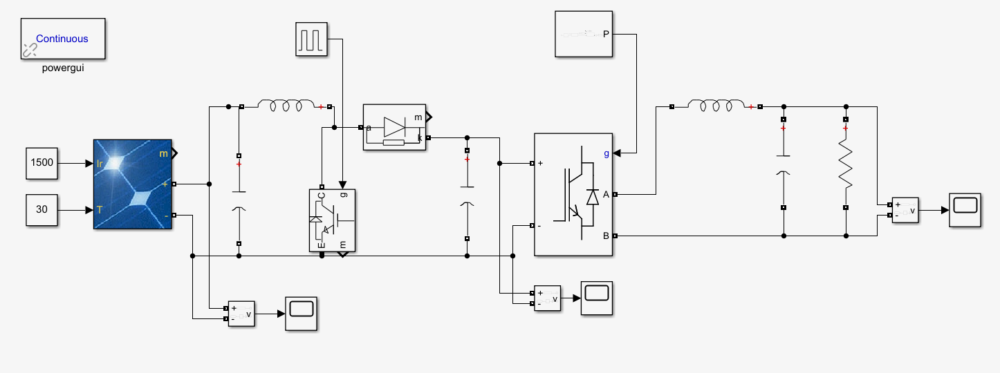

# A Home Solar Power System in Simulink

This is a complete simulation of a home solar power setup, built in MATLAB Simulink. It shows the entire journey of converting sunlight from a solar panel into the AC electricity that powers our appliances.

## Project Objective

[cite_start]The main goal here is to create a digital twin of a real solar panel and all the electronics needed to turn its power into a steady, usable form to supply a constant power to a load[cite: 20].

## System Architecture

Think of this system as an energy assembly line with three main stops. This is a typical setup for an off-grid solar power system where energy flows in three stages:

1.  **☀️ Catching the Sun**: A digital solar panel captures sunlight and turns it into DC electricity.
2.  **🔼 Boosting the Power**: A special circuit takes the low-voltage DC from the panel and boosts it into a high-voltage, stable DC.
3.  **🔄 Creating Usable Electricity**: This final stage takes the high-voltage DC and converts it into the standard AC power that our homes use.

## Component Breakdown

Here’s a simple look at what each part does:

* **PV Array**: This is our digital solar panel. It takes in sunlight (irradiance) and temperature to create electricity, just like a real one.
* **DC-DC Boost Converter**: The power from the panel is a bit weak, so this part acts as a voltage booster, taking low DC voltage and turning it into high DC voltage.
    * **Input Capacitor (Cin)**: Acts as a buffer to smooth out the power coming from the panel.
    * **IGBT**: A super-fast electronic switch that is the heart of the booster.
    * **Inductor**: Works with the IGBT switch to store and release energy, which is what boosts the voltage.
    * **Diode**: A one-way street for electricity, making sure it flows in the right direction.
    * **Pulse Generator (PWM)**: The "brain" that tells the IGBT switch when to turn on and off. The timing of these pulses controls the final voltage.
    * **Output Capacitor (Cout)**: Another buffer that smooths out the newly boosted power, making it a nice, stable DC link.
* **Passive Filter**: This helps clean up the electrical signal, making sure the final output is a pure AC waveform.
* **DC-AC Inverter**:
    * **Component**: A Universal Bridge, which is a ready-made block that acts as an inverter.
    * **Function**: The final step. It takes the stable, high-voltage DC and flips it back and forth very quickly to create the AC power our homes use.

## Simulation Parameters

To make our simulation feel real, we've set it up with these conditions:

| Setting                   | Value     |
| ------------------------- | --------- |
| Average Sunlight          | 289 W/m²  |
| Ideal Sunlight (for tests)| 1000 W/m² |
| How Warm the Panel Is     | 30 °C     |
